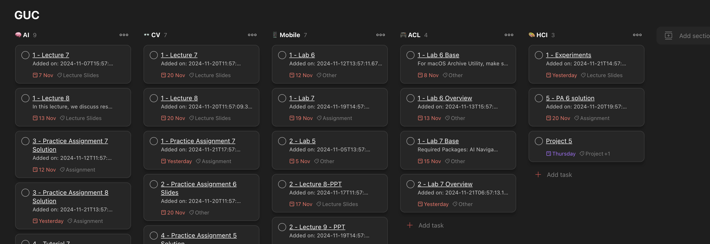
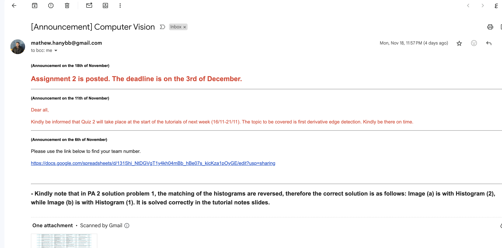

# GUC Assistant

A BaaS (Backend as a Service) that helps GUC students keep on top of their emails, course work and assignments.





> **Note:** I already have this up and running on AWS. For now, I can only handle a few users for free. I plan to optimize this to make it possible to host for more free users and build a front-end to make getting started as easy as just filling a form. For now, if you want to use this, you can either contant me and I will add you to the beta if possible, or you can host it on your own AWS. For only one user, it should be under the free-tier limits.

## 🔥 Features

### 📢 Never miss an important email or announcement or course item
- 📭 Forwards emails from your GUC mail to your Gmail
- 📢 Send you Gmail notificaions for new course announcements
- ⏰ Sends email to notify user about newly added course items

### 🗂️ Stay organized and on top of your course work
- 🗓️ Automatically add newly course items to Todoist under correct project and section
- 🔥 A Todoist project is created automatically with a section for each course

### 🚀 Easy to use
- ⏲️ No need to manually run the script, it runs on the cloud 
- 👨🏻‍🎓 Handles multiple users

## 📆 Roadmap
TODO: Add roadmap

## 🛠️ Tech Stack

- [AWS CDK](https://aws.amazon.com/cdk/)
- [AWS Lambda](https://aws.amazon.com/lambda/)
- [AWS DynamoDB](https://aws.amazon.com/dynamodb/)
- [AWS SQS](https://aws.amazon.com/sqs/)
- [AWS SNS](https://aws.amazon.com/sns/)
- [AWS EventBridge](https://aws.amazon.com/eventbridge/)
- [Todoist API](https://developer.todoist.com/rest/v1/)
- [Python](https://www.python.org/)

## 🏗️ Setup on your own infrastructure

### Prerequisites

- [Node.js](https://nodejs.org/en/)
- [AWS CLI](https://aws.amazon.com/cli/)
- [AWS CDK](https://aws.amazon.com/cdk/)

### Steps

1. Clone the repository
2. Run `npm install` to install the required dependencies
3. Login to your AWS account using the AWS CLI. Follow the instructions [here](https://docs.aws.amazon.com/cli/latest/userguide/cli-configure-quickstart.html).
4. Run `cdk bootstrap` to create the required resources in your AWS account
5. Create a `.env` file in the root directory with the following content:
   ```env
   GMAIL_SENDER_EMAIL=<your-email>
   GMAIL_SENDER_PASSWORD=<your-password>
   ```
   Replace `<your-email>` with your Gmail email. This email will be used to send notifications to users. Replace `<your-password>` with your App Password. You can create an App Password by following the instructions [here](https://support.google.com/accounts/answer/185833?hl=en).
6. Run `cdk deploy` to deploy the stack to your AWS account
   Keep note of the output values, you will need them later
   ```
   Outputs:
   GucAssistantStack.FetchUsersUrlOutput = <fetch-users-url>
   GucAssistantStack.RegisterUserUrlOutput = <register-user-url>
   ```

7. Register a user by sending a POST request to the register url with the following body:
   ```json
   {
     "username": "<your-guc-username>",
     "password": "<your-guc-password>",
     "email": "<email-to-send-notifications-to>",
     "todoist_token": "<your-todoist-token>"
   }
   ```
   The `todoist_token` can be obtained by following the instructions [here](https://developer.todoist.com/rest/v1/#authorization).

8. (Optional) To immediately fetch the user's courses, send a request to the fetch users url. Otherwise, if you wait for a few minutes, the courses will be fetched automatically by the scheduler (It runs every 1 hour).

## Architecture
TODO: Add architecture diagram
